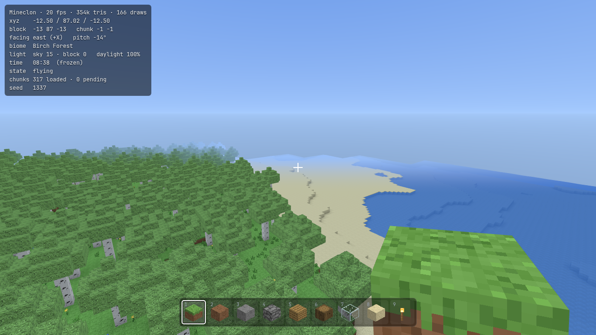
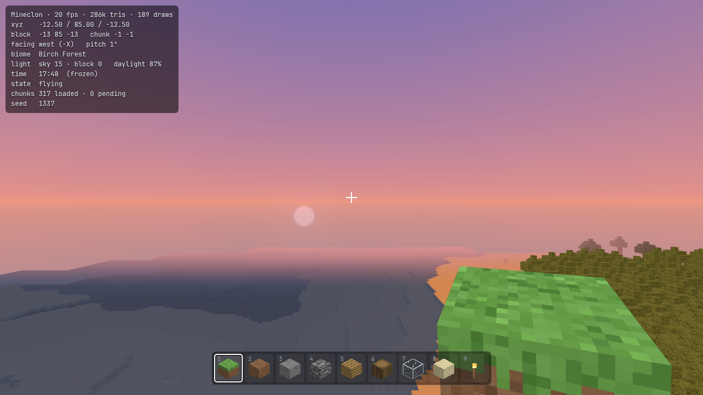
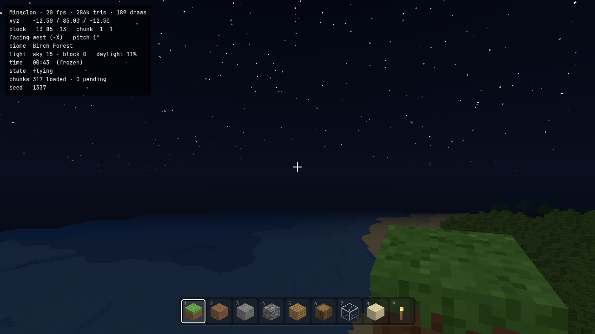
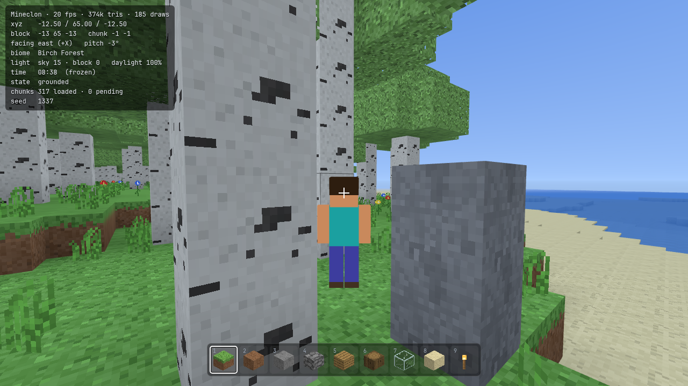
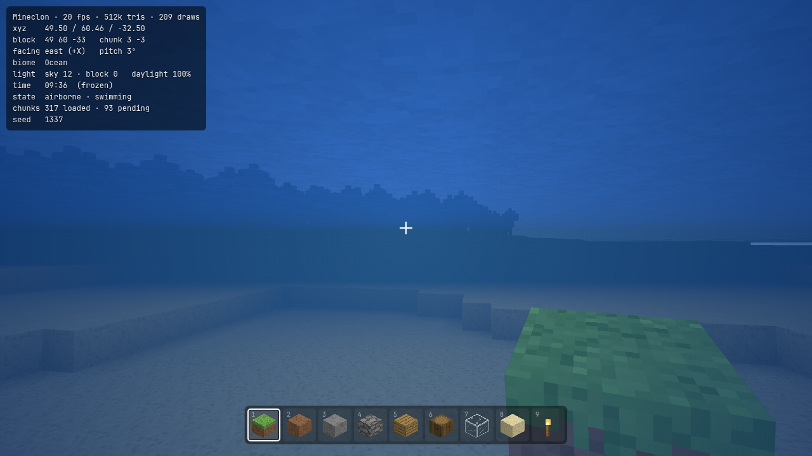
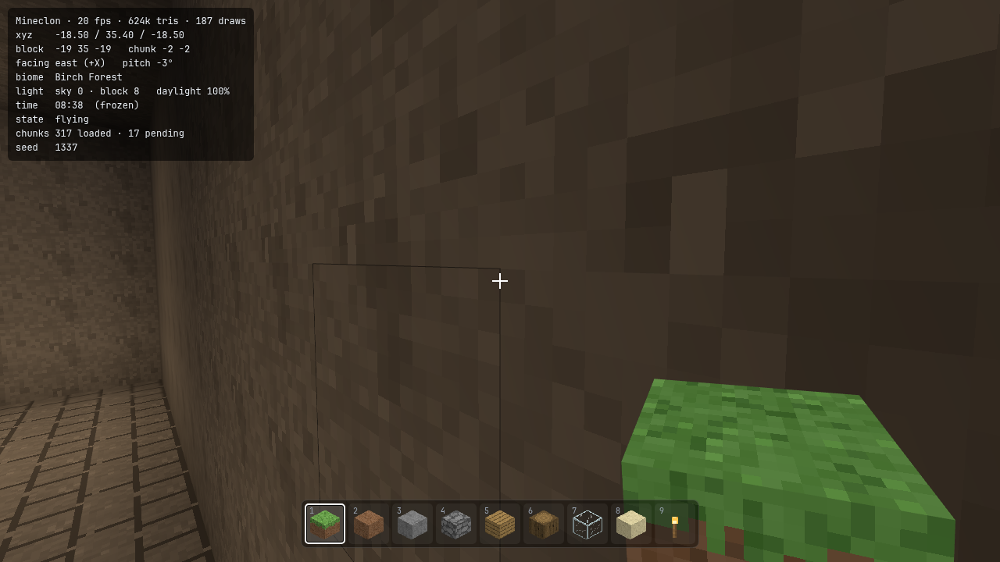

# Mineclon

A voxel sandbox game (Minecraft clone) that runs entirely in the browser, built from scratch with [Three.js](https://threejs.org/) and [Vite](https://vitejs.dev/).



## Running it

```bash
npm install
npm run dev
```

Then open `http://localhost:5173` in a browser with WebGL2 support.

To build for production:

```bash
npm run build
npm run preview
```

## Controls

| Key | Action |
|---|---|
| `WASD` | Move |
| `Space` | Jump / swim up |
| `Shift` | Sneak / descend while flying |
| `Ctrl` | Sprint |
| `Space` x2 | Toggle flight |
| Left click | Break block |
| Right click | Place block |
| Middle click | Pick block |
| `1`–`9` / Scroll | Select hotbar slot |
| `E` | Inventory |
| `F3` | Debug overlay |
| `F5` | Cycle camera |
| `T` | Toggle time |
| `N` | Freeze time |
| `Esc` | Pause |

## Screenshots

| Sunset | Night |
|---|---|
|  |  |

| Third Person | Underwater |
|---|---|
|  |  |

| Cave |
|---|
|  |

---

> This README was added in a separate prompt from the one that built the game.
> The entire codebase was generated by AI in a single conversation.
